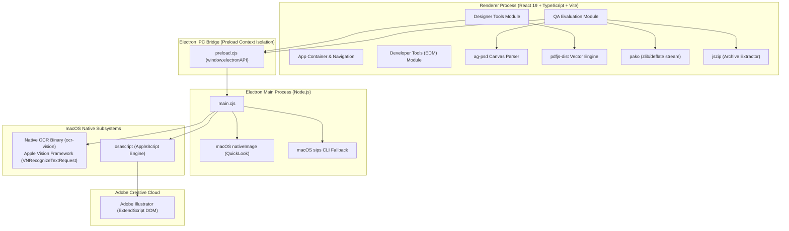

# BMW Automation Studio (macOS)

[-000000.svg?logo=apple&logoColor=white)](https://www.apple.com/macos/)
[](https://www.electronjs.org/)
[](https://react.dev/)
[](https://www.typescriptlang.org/)
[](https://vitejs.dev/)
[](https://developer.apple.com/documentation/vision)

**BMW Automation Studio** is an enterprise-grade macOS desktop application engineered for creative production agencies (such as Craft Worldwide / IPG) and marketing teams managing global and regional campaigns for **BMW**.

The application streamlines high-volume marketing adaptations—transforming master creative files (`.psd`, `.psb`, `.ai`) into localized regional dealer variations, automating Adobe Illustrator DOM manipulation via native AppleScript/ExtendScript bridges, and running automated, deep Quality Control (QC) on batches of creative outputs using native **Apple Vision framework OCR**, direct PSD/PDF vector stream decoding, and an offline brand-aware dictionary engine.

> [!TIP]
> **OMC Leadership, Designers & QA Teams**: For detailed business specifications, OMC strategic value analysis, and step-by-step Standard Operating Procedures (SOPs), refer to the comprehensive [**Operations & User Handbook (`handbook.md`)**](file:///Users/mehul.rana/Library/CloudStorage/OneDrive-Interpublic/Projects-2026/BMW-automation/bmw-app/bmw-macOs-app/handbook.md).

---

## Table of Contents

- [1. Business Overview & Value Proposition](#1-business-overview--value-proposition)
  - [The Problem](#the-problem)
  - [The Solution](#the-solution)
  - [Key Business Benefits](#key-business-benefits)
- [2. System Architecture](#2-system-architecture)
  - [Architecture Diagram](#architecture-diagram)
  - [Process & Security Model](#process--security-model)
- [3. Feature Modules](#3-feature-modules)
  - [Module 1: Designer Tools (Master Adapt Automation)](#module-1-designer-tools-master-adapt-automation)
  - [Module 2: Developer Tools (EDM Production)](#module-2-developer-tools-edm-production)
  - [Module 3: QA Evaluation & Content QC Engine](#module-3-qa-evaluation--content-qc-engine)
- [4. Technical Specifications & Stack](#4-technical-specifications--stack)
- [5. Repository Structure](#5-repository-structure)
- [6. Prerequisites & Environment Setup](#6-prerequisites--environment-setup)
- [7. Running Locally](#7-running-locally)
  - [Development Mode (Desktop App)](#development-mode-desktop-app)
  - [Web-Only Dev Server](#web-only-dev-server)
  - [Compiling Native Swift OCR](#compiling-native-swift-ocr)
- [8. Production Build & Distribution](#8-production-build--distribution)
- [9. Deep-Dive: Core Engines](#9-deep-dive-core-engines)
  - [Adobe Illustrator Automation Bridge](#adobe-illustrator-automation-bridge)
  - [Native Apple Vision OCR vs. Tesseract](#native-apple-vision-ocr-vs-tesseract)
  - [PSD & Smart Object Vector Stream Parser](#psd--smart-object-vector-stream-parser)
  - [Proprietary BMW Dictionary & Stemming Engine](#proprietary-bmw-dictionary--stemming-engine)
- [10. Troubleshooting & FAQ](#10-troubleshooting--faq)

---

## 1. Business Overview & Value Proposition

### The Problem
During major automotive campaign rollouts (e.g., seasonal offers, new electric vehicle launches like the BMW i4/i7/iX, M Performance campaigns), creative production studios must produce **hundreds of asset variations** across multiple channels:
- **Print & OOH**: Press ads, magazine spreads, outdoor hoardings, and showroom displays.
- **Digital Display**: Standard IAB banners (300x250, 728x90, 160x600, etc.).
- **Social & CRM**: Vertical (9:16) stories, square (1:1) feeds, and Email Direct Marketing (EDM).

Each variation requires adapting master artwork to reflect specific **regional dealerships** (e.g., BMW Infinity Cars Worli, BMW Navnit Motors Andheri), inserting:
1. Exact dealership trade names and physical showroom locations.
2. Official regional contact telephone numbers and localized domain URLs.
3. Strict regulatory and financial disclaimers (MSRP, APR, EMI disclosures, WLTP fuel/energy figures, warranty statements).

**Manual adaptation has severe drawbacks:**
- **High Labor Cost & Inefficiency**: Designers spend hours copying and pasting strings, resizing text frames, and manually exporting files.
- **Brand & Compliance Risks**: Typos in disclaimers, incorrect phone numbers, or outdated legal copy can trigger regulatory fines or customer disputes.
- **Slow Turnaround**: Campaign rollouts are bottlenecked by manual review cycles.

### The Solution
**BMW Automation Studio** automates the end-to-end production workflow:
1. **Master File Ingestion**: Ingests master `.psd`, `.psb`, or `.ai` creative files, extracting layer coordinates and vector streams.
2. **One-Click Dealer Syndication**: Links directly into Adobe Illustrator to duplicate artboards, bind text targets, and export ready-to-publish files for every selected dealer in seconds.
3. **Automated Batch Quality Control**: Automatically validates output assets (as single files, PSDs with multiple artboards, or complete ZIP packages), extracting text via macOS hardware-accelerated OCR, checking specifications, and flagging spelling errors against an offline dictionary and BMW brand whitelist.

### Key Business Benefits
| Metric | Manual Process | With BMW Automation Studio |
| :--- | :--- | :--- |
| **Adaptation Speed** | 10–15 minutes per dealer variation | < 5 seconds per variation (batch automated) |
| **QA Inspection Time** | 3–5 minutes per asset (visual proofing) | Instantaneous automated batch processing |
| **Text Error Rate** | ~3–5% human error rate on legal text | 0% transcription error with automated binding |
| **Brand Consistency** | Subject to individual designer accuracy | Enforced BMW CI/CD standards & official fonts |

---

## 2. System Architecture

BMW Automation Studio combines an **Electron 43** desktop container, a **React 19** user interface built with Vite, a native **Apple Vision framework Swift CLI**, and an **AppleScript/ExtendScript Adobe Illustrator Bridge**.

### Architecture Diagram



### Process & Security Model
- **Context Isolation Enabled**: `contextIsolation: true` prevents the web renderer from accessing Node.js primitives directly.
- **Node Integration Disabled**: `nodeIntegration: false` protects the DOM against untrusted script execution.
- **Preload API Whitelist**: The renderer accesses native capabilities strictly through the typed `window.electronAPI` bridge:
  - `getFilePreview(data)`: Generates thumbnails via macOS QuickLook / `sips`.
  - `getIllustratorLayers()`: Fetches document hierarchy from active Adobe Illustrator instance.
  - `generateIllustratorVariations(data)`: Triggers automated `.ai` export for selected dealers.
  - `runNativeOCR(data)`: Dispatches images to the compiled Apple Vision Swift binary.
  - `reloadApp()`: Reloads renderer ignoring cache.

---

## 3. Feature Modules

### Module 1: Designer Tools (Master Adapt Automation)
Engineered for graphic designers to convert master campaign designs into multi-dealer variations without manual copy-pasting.

1. **Master File Support**:
   - Accepts `.psd`, `.psb` (Photoshop Large Document Format), and `.ai` (Adobe Illustrator).
   - Extracts metadata: dimensions, color depth, top-level layer count, and last modified timestamps.
2. **Dual-Path Illustrator Preview**:
   - **Path A (Crisp Vector PDF)**: Uses `pdfjs-dist` to render Illustrator files saved with "Create PDF Compatible File" at high DPI into an interactive HTML5 canvas.
   - **Path B (XMP Thumbnail Fallback)**: For non-PDF compatible files, reads internal XMP metadata streams (`<xmpGImg:image>`) to render an instant base64 JPEG thumbnail.
3. **Interactive Visual Layer Binding**:
   - Communicates with the live Adobe Illustrator document via AppleScript.
   - Converts Illustrator artboard coordinates into an SVG interactive overlay positioned directly over the preview image.
   - Designers click on the target dealer address/disclaimer frame to bind it.
4. **Dealership Database Syndication**:
   - Select one, multiple, or all dealerships from the integrated directory.
   - Generates individualized `.ai` files directly into `~/Desktop/BMW_Generated_Ads/`.
   - Modifies document contents and executes `saveAs` non-destructively, restoring the master document upon completion.

### Module 2: Developer Tools (EDM Production)
A dedicated module for rapid construction of **BMW Email Direct Marketing (EDM)** campaigns:
- Scaffolds BMW brand-compliant responsive email templates.
- Enforces HTML email standards (table layouts, inline styles, retina image tags, cross-client compatibility across Apple Mail, Outlook, and Gmail).

### Module 3: QA Evaluation & Content QC Engine
An automated Quality Assurance powerhouse that checks design assets against BMW branding and specifications.

1. **Universal Asset Ingestion**:
   - Drag and drop single images (`.jpg`, `.png`, `.webp`, `.tiff`, `.bmp`).
   - Drag and drop layered Photoshop files (`.psd`) containing single or multiple artboards.
   - Drag and drop Adobe Illustrator files (`.ai`) — every artboard in the document becomes its own QC row.
   - Drag and drop compressed `.zip` archives. The system unpacks the archive in memory, sanitizes out macOS hidden files (`__MACOSX`, `.DS_Store`), and evaluates all contained assets.
2. **Multi-Artboard PSD Inspection**:
   - Automatically detects Photoshop artboards (`child.artboard.rect`).
   - Renders independent high-fidelity canvas previews for every individual artboard.
   - Extracts layer text directly from vector text layers and embedded Smart Objects (AI/PDF smart objects decompressed via `pako`).
3. **Apple Vision Framework OCR**:
   - For raster files or flattened PSDs, invokes macOS native `VNRecognizeTextRequest`.
   - **Language correction explicitly disabled** (`usesLanguageCorrection = false`) so deliberate typos or transcription errors in ads are never masked by macOS auto-correct.
   - Minimum text height set to `0.0` to detect fine legal disclaimers and micro-footnotes.
4. **Proprietary Spell Checking & Whitelist Engine**:
   - 2.49 MB full offline English dictionary (`en_words.txt`).
   - BMW-specific whitelist covering model series, electric vehicle lines, proprietary technologies, and automotive terminology.
   - 40+ comprehensive morphological stemming rules.
5. **Multi-Artboard Illustrator Inspection**:
   - Reads the PDF-compatible stream of an `.ai` file, treating each PDF page as one Illustrator artboard.
   - Reports true artboard dimensions and renders every artboard at high resolution for preview and machine inspection.
   - Pulls live vector copy straight from the document, so spell checking runs at 100% confidence with no OCR step.
6. **QR Link Validation** (`QR Links` column, shown for Illustrator deliveries):
   - Decodes the QR code embedded in each artboard from the high-resolution render, sweeping the frame in overlapping tiles so a small corner block is still found.
   - Validates each decoded link on two parameters, reported as a pair of badges:
     - **Working Link / Broken Link** — the URL is requested through the Electron main process (HEAD, falling back to GET, following up to 5 redirects). Any 4xx/5xx, DNS failure, TLS failure, or timeout marks the link broken.
     - **IN Link** — the destination resolves to an Indian host (a `.in` TLD such as `bmw.in` or `bmw.co.in`, or an `in` country subdomain such as `in.bmw.com`). Shortlinks are judged on where they *land*, so a `bit.ly` that redirects to a `.in` page is still flagged as an IN link.
7. **Default Value Detection** (`Default Values` column):
   - Flags any artboard still carrying text in the BMW placeholder magenta — `#FF00FF` / `rgb(255, 0, 255)` / `cmyk(0, 100, 0, 0)` / `hsl(300, 100%, 50%)`.
   - Reads the colour from the layer data rather than guessing from pixels: PSD text-layer `fillColor` (including per-range style runs), AI/PDF fill operators, and the streams of embedded AI smart objects. Rendered pixels are only sampled as a last resort, for fully rasterised assets.
   - Marked **✅ Default Text** when placeholder copy is present, or **—** when the artboard is clean. The expanded row lists the exact offending strings.
8. **Interactive QC Reporting**:
   - **Single Image Mode**: Technical specs (width, height, aspect ratio, color depth, file size), OCR confidence meter, full extracted copy, and itemized flagged issues with surrounding sentence context.
   - **Batch Mode**: Top-level KPI metrics (Total Assets, Aggregate Size, Pass Count, Flagged Count), multi-column table, and collapsible preview drawers.
   - **Column Filters**: File-name search plus dropdown filters for Dimensions, Format, QR Links (working / broken / IN / non-IN / no QR), Default Values, and Status. Filters combine with AND, the KPI tiles follow the filtered set, and a single **Clear** resets everything.

---

## 4. Technical Specifications & Stack

| Layer | Technology | Purpose & Details |
| :--- | :--- | :--- |
| **Desktop Runtime** | **Electron 43.2.0** | Cross-process desktop shell, window management (`titleBarStyle: hiddenInset`), native menu, and IPC orchestration. |
| **UI Framework** | **React 19.2.7** | Modern component tree with concurrent rendering and hooks. |
| **Language** | **TypeScript ~6.0.2** | Strict type-safety across renderer, utility libraries, and data models. |
| **Build Tooling** | **Vite 8.1.5** | Lightning-fast HMR and optimized production bundling with `@vitejs/plugin-react`. |
| **Linter** | **Oxlint 1.71.0** | High-performance Rust-based linter. |
| **Packaging** | **Electron Builder 26.15.3** | Automated macOS `.dmg` packaging targeting `arm64` and `x64`. |
| **Native Vision OCR** | **Swift 6.3 / Apple Vision** | Native macOS CLI (`ocr-vision`) utilizing `Vision.framework` and `AppKit.framework`. |
| **Photoshop Parser** | **ag-psd 31.0.2** | Parses layered PSD/PSB files, artboards, and smart object streams in browser/Node canvas. |
| **Vector PDF Engine** | **pdfjs-dist 6.2.108** | Extracts vector artboards from Illustrator PDF streams via dedicated web worker. |
| **Decompression** | **pako 3.0.1** | High-speed zlib/deflate decompression of embedded PDF/AI PostScript text operators (`BT...ET`). |
| **Archive Handler** | **jszip 3.10.1** | In-memory decompression of multi-gigabyte ZIP archives. |
| **QR Decoder** | **jsqr 1.4.0** | Pure-JS QR symbol detection over rendered artboard pixels, with inversion and threshold retries. |
| **Fallback OCR** | **tesseract.js 7.0.0** | Standalone offline WASM SIMD LSTM engine with bundled English traineddata. |
| **Typography** | **BMW Type Next** | Official BMW brand fonts (`BMWTypeNext-Light.otf`, `BMWTypeNext-Bold.otf`). |
| **Design System** | **Vanilla CSS3** | Custom dark mode ("void canvas" `#0a0a0a`), frosted glassmorphism, and responsive CSS grids. |

---

## 5. Repository Structure

```
bmw-macOs-app/
├── electron/
│   ├── main.cjs                    # Electron main process (window lifecycle, IPC handlers)
│   ├── preload.cjs                 # Secure contextBridge API definition
│   ├── illustrator-bridge.cjs      # AppleScript & ExtendScript Adobe Illustrator automation
│   ├── ocr-vision.swift            # Native Swift source using Apple Vision framework
│   └── ocr-vision                  # Compiled native macOS arm64 binary
├── public/
│   ├── logo.png                    # BMW brand emblem
│   ├── icons.svg                   # Vector interface icons
│   └── tesseract/                  # Offline WASM fallback OCR models
│       ├── eng.traineddata         # Tesseract English neural net data (23.4 MB)
│       ├── tesseract-core-simd-lstm.wasm # WebAssembly SIMD engine
│       └── worker.min.js           # Web worker script
├── src/
│   ├── assets/
│   │   ├── dictionary/
│   │   │   └── en_words.txt        # Offline English dictionary (2.49 MB, ~235k words)
│   │   ├── fonts/                  # Official BMW brand typography
│   │   │   ├── BMWTypeNext-Bold.otf
│   │   │   └── BMWTypeNext-Light.otf
│   │   └── images/
│   │       ├── logo.png
│   │       └── mockup_preview.png
│   ├── components/
│   │   ├── DealersDatabase.tsx     # Dealership selector component & mock database
│   │   ├── QaModule.tsx            # Main QA interface (Upload, Processing, Single/Batch Reports)
│   │   ├── QaModule.css            # Styles for QA dashboard, dropzones, tables, badges
│   │   ├── qaUtils.ts              # Core logic: PSD parsing, OCR dispatch, smart object text, spelling
│   │   ├── aiUtils.ts              # Illustrator (.ai) artboard parsing, vector copy, magenta fill operators
│   │   ├── qrUtils.ts              # QR symbol detection and link validation (reachable / Indian destination)
│   │   ├── colorUtils.ts           # Colour-space normalisation and magenta (#FF00FF) placeholder detection
│   │   └── qaFilters.ts            # Filter model for the QA results table
│   ├── App.tsx                     # Main layout, sidebar navigation, module switcher, Designer tools
│   ├── App.css                     # Application layout, glass panels, forms, and cards
│   ├── index.css                   # CSS design tokens, BMW typography declarations, root variables
│   ├── main.tsx                    # React application mount point
│   └── vite-env.d.ts               # Vite & environment type definitions
├── index.html                      # HTML5 entry point
├── handbook.md                     # Operational & Technical Handbook (Business Specs, OMC Value, SOPs)
├── README.md                       # Project Technical Documentation & Local Setup Guide
├── package.json                    # Project dependencies, scripts, and electron-builder config
├── tsconfig.json                   # TypeScript project references
├── tsconfig.app.json               # TypeScript frontend application config
├── tsconfig.node.json              # TypeScript Node/Vite build config
└── vite.config.ts                  # Vite build configuration
```

---

## 6. Prerequisites & Environment Setup

### System Requirements
1. **Operating System**: **macOS 12.0 (Monterey)** or later (required for Apple Vision framework text recognition and AppleScript automation). Compatible with **Apple Silicon (M1/M2/M3/M4)** and **Intel** Macs.
2. **Node.js**: Version **18.0.0** or higher (Node v20+ or v24+ recommended).
3. **Xcode Command Line Tools**: Required if compiling or modifying the native Swift OCR binary:
   ```bash
   xcode-select --install
   ```
4. **Adobe Illustrator** *(Optional)*: Required only if running live Illustrator bridge automation to generate ad variations.

---

## 7. Running Locally

### 1. Clone and Install Dependencies
```bash
# Clone the repository
git clone <repository-url>
cd bmw-macOs-app

# Install dependencies
npm install
```

### 2. Development Mode (Desktop App)
To launch the full Electron desktop application with hot-reloading:
```bash
npm run dev
```
*What this does:*
1. Starts the Vite development server on `http://localhost:5173`.
2. Uses `wait-on tcp:5173` to verify the dev server is live.
3. Launches Electron loading `http://localhost:5173` with DevTools open.

### 3. Web-Only Dev Server (Fast UI Testing)
If you only want to test UI components, styling, or browser-based PSD parsing without launching Electron:
```bash
npx vite
```
Then open `http://localhost:5173` in Google Chrome or Safari.  
*(Note: Illustrator automation and Apple Vision OCR will gracefully fall back to web alternatives when running outside Electron).*

### 4. Compiling the Native Swift OCR Binary
The pre-compiled binary (`electron/ocr-vision`) is included for Apple Silicon (`arm64`). If you modify `electron/ocr-vision.swift` or need to build for an Intel Mac (`x86_64`), compile it with `swiftc`:

```bash
# For Apple Silicon (M1/M2/M3/M4):
swiftc -O -target arm64-apple-macos12.0 electron/ocr-vision.swift -o electron/ocr-vision

# For Intel Macs:
swiftc -O -target x86_64-apple-macos12.0 electron/ocr-vision.swift -o electron/ocr-vision

# For Universal Binary (supports both architectures):
swiftc -O -target arm64-apple-macos12.0 electron/ocr-vision.swift -o electron/ocr-vision-arm64
swiftc -O -target x86_64-apple-macos12.0 electron/ocr-vision.swift -o electron/ocr-vision-x86
lipo -create electron/ocr-vision-arm64 electron/ocr-vision-x86 -output electron/ocr-vision
rm electron/ocr-vision-arm64 electron/ocr-vision-x86

# Ensure executable permissions:
chmod +x electron/ocr-vision
```

---

## 8. Production Build & Distribution

### 8.1 Compiling the Production Web Bundle
```bash
npm run build
```
Runs `tsc -b` to validate TypeScript types, followed by `vite build` to output optimized assets into `dist/`.

### 8.2 Building the macOS DMG Installer
To package the entire application into a standalone, distributable `.dmg` disk image:
```bash
npm run build:electron
```

#### What this command does:
1. **Compiles Web Assets**: Executes `npm run build` to ensure the latest React 19 / TypeScript bundle is built into `dist/`.
2. **Prepares Native Assets**: Bundles the multi-resolution app icon (`public/icon.icns`, 16x16 to 1024x1024) and bundles the native `ocr-vision` Swift binary via `extraResources` directly into `Contents/Resources/electron/ocr-vision`.
3. **Invokes Electron Builder**: Bundles the Electron 43 runtime, main processes, and renderer code.
4. **Generates DMG**: Uses `dmgbuild` to create a standard macOS drag-and-drop installer:
   - **Output File**: `release/BMW Auto-0.0.0-arm64.dmg` (~174 MB)
   - **Application Name**: `BMW Auto.app`
   - **Application ID**: `com.bmw.automation`
   - **Target Architecture**: `arm64` (Apple Silicon M1/M2/M3/M4)

---

### 8.3 Multi-Architecture Packaging (Intel & Universal)

By default on Apple Silicon Macs, `npm run build:electron` builds for `arm64`. To build for Intel Macs or create a single Universal binary for organization-wide deployment:

```bash
# 1. Build specifically for Intel Macs (x64):
npx electron-builder --mac --x64

# 2. Build a Universal Binary (combines Apple Silicon & Intel into one DMG):
npx electron-builder --mac --universal
```
*(Note: If building a Universal package, ensure the native Swift binary has been compiled as a universal binary using `lipo` as documented in Section 7.4).*

---

### 8.4 Enterprise Distribution & Installation Guide

Distribute the generated `BMW Auto-0.0.0-arm64.dmg` file across team members via OneDrive, Google Drive, AirDrop, or your organization's MDM software (e.g., Jamf, Microsoft Intune, Munki).

#### End-User Installation Instructions:
1. Double-click `BMW Auto-0.0.0-arm64.dmg` to mount the disk image.
2. Drag **BMW Auto** into your **Applications** folder.
3. Eject the disk image.

#### macOS Gatekeeper & Security Notice (Unsigned Enterprise Builds):
If distributing internally without an Apple Developer ID code-signing certificate, team members may encounter macOS Gatekeeper when opening the app for the first time (*"BMW Auto cannot be opened because the developer cannot be verified"* or *"Apple could not verify that BMW Auto is free of malware"*).

To launch the app:
- **Method A (GUI)**: In Finder, navigate to `Applications`, **Right-click (or Control-click)** on `BMW Auto.app`, select **Open**, and click **Open** in the confirmation dialog.
- **Method B (System Settings)**: Open `System Settings > Privacy & Security`, scroll down to the Security section, and click **"Open Anyway"** next to *BMW Auto was blocked from use*.
- **Method C (Terminal / IT Admins)**: Remove the quarantine flag from the application:
  ```bash
  xattr -cr "/Applications/BMW Auto.app"
  ```

---

### 8.5 Code Quality & Linting
Run the fast Rust-based Oxlint linter before packaging:
```bash
npm run lint
```

---

## 9. Deep-Dive: Core Engines

### Adobe Illustrator Automation Bridge
The bridge (`electron/illustrator-bridge.cjs`) uses a two-tier execution strategy:
1. **Host Level**: Node.js generates temporary ExtendScript (`.jsx`) and AppleScript (`.scpt`) files in `os.tmpdir()`.
2. **System Level**: Executes AppleScript via `osascript`, instructing Adobe Illustrator to execute the script in its native JavaScript engine:
   ```applescript
   tell application "Adobe Illustrator"
     activate
     set scriptResult to do javascript file (POSIX file "/path/to/script.jsx")
     return scriptResult
   end tell
   ```
3. **Data Marshalling**: Because ExtendScript uses an older ECMAScript 3 engine lacking native JSON, data is safely URL-encoded and serialized into clean JSON strings returned to the Electron main process.
4. **Non-Destructive Generation**: When generating variations for dealers, the script modifies the target text frame, executes `doc.saveAs` with PDF-compatible settings to `~/Desktop/BMW_Generated_Ads/<dealer_name>.ai`, and immediately restores the original frame text content.

### Native Apple Vision OCR vs. Tesseract
| Dimension | Native Apple Vision (`ocr-vision`) | Standard Tesseract.js |
| :--- | :--- | :--- |
| **Execution** | Hardware-accelerated Neural Engine / GPU | WebAssembly CPU worker thread |
| **Speed** | 100–250 ms per high-res artwork | 2,000–6,000 ms per image |
| **Small Disclaimers** | Detects text down to 4–6 px height | Often blurs or skips text under 12 px |
| **Text on Gradients** | Superior contrast handling on automotive backgrounds | Prone to noise and missed characters |
| **Typo Preservation** | `usesLanguageCorrection = false` ensures errors are caught | Auto-correct models often mask spelling bugs |

### PSD & Smart Object Vector Stream Parser
When a `.psd` file is analyzed (`src/components/qaUtils.ts`):
1. **Artboard Discovery**: Inspects `psd.children` for `child.artboard.rect` coordinates.
2. **Direct Text Layers**: Reads native text frame strings with 100% confidence.
3. **Embedded Vector Smart Objects**:
   - Locates placed linked files (`psd.linkedFiles`).
   - If an embedded file is a vector Illustrator/PDF file (`%PDF` magic bytes), decompresses the raw stream using `pako.inflate()`.
   - Parses the PostScript content stream operators:
     - `BT` (Begin Text) to `ET` (End Text)
     - `TJ` operators (kerning array strings) and `Tj` operators (standard strings)
   - Extracts all copy without rasterizing the vector artwork.

### Illustrator Artboard Engine
An `.ai` file saved with PDF compatibility *is* a PDF, one page per artboard, so `src/components/aiUtils.ts` drives it through pdf.js:
1. **Artboard Discovery**: `pdf.numPages` gives the artboard count; `page.getViewport({ scale: 1 })` gives true artboard pixels (a PDF point maps 1:1 to an Illustrator pixel).
2. **High-Resolution Render**: Each artboard is rendered to a canvas scaled towards an 1800 px long edge (capped at 4×) so QR modules stay legible. The preview blob is then written back down to the artboard's own size — the analysis needs the resolution, the thumbnail does not.
3. **Vector Copy**: `page.getTextContent()` returns the live text, preserving line breaks via `hasEOL`. Only artwork with fully outlined type falls back to Apple Vision OCR.
4. **Fill Colour Inspection**: `page.getOperatorList()` is walked with a graphics-state stack (`save`/`restore`), tracking the active fill and collecting the glyphs drawn while it is magenta. Text set to invisible rendering modes (`Tr 3`, `Tr 7`) is ignored.
5. **Graceful Degradation**: A file saved *without* PDF compatibility raises `AiParseError`, and the asset still appears in the report using its embedded XMP thumbnail.

> **Note**: The app deliberately imports pdf.js's `legacy` build. The modern bundle calls very recent JS built-ins (`Map.prototype.getOrInsertComputed` among them) that the Chromium inside Electron may not ship yet — without the legacy build, page rendering and operator lists throw and every artboard comes back blank.

### QR Detection & Link Validation
1. **Detection** (`src/components/qrUtils.ts`): the artboard render is normalised into jsQR's sweet spot, decoded whole-frame, then swept as a 5×5 grid of third-size tiles stepping by half a tile — so any QR up to a third of the frame lands whole inside at least one tile no matter where it sits. Flat tiles are rejected by a cheap luminance-range test before jsQR is asked. If nothing is found, the frame and tiles are re-read with a hard black/white threshold, which rescues low-contrast and brand-tinted prints.
2. **Validation** (`electron/main.cjs`, `check-url` IPC): requests run in the main process so they are not blocked by renderer CORS. HEAD first, retried with GET for the many servers that reject HEAD, following up to 5 redirects with a 12 s timeout. Verdicts are cached per batch so a shared landing page is fetched once.
3. **Destination Test**: the hostname of both the original and final URL is split on `.`; an `in` segment means an Indian destination. This matches `bmw.in` and `bmw.co.in` as well as `in.bmw.com`, while correctly leaving `linkedin.com` and `india.com` alone.

### Magenta Placeholder ("Default Values") Detection
`src/components/colorUtils.ts` normalises every colour shape the pipeline can produce — RGB/RGBA (0–255), FRGB (0–1), CMYK, HSB, Grayscale — into plain RGB, then tests it in HSL space against a set of anchors rather than a single hard-coded hex:

| Anchor | Rendered as | Why it is needed |
| :--- | :--- | :--- |
| sRGB magenta | `#FF00FF` (hue 300°) | Photoshop text layers and RGB Illustrator documents. |
| DeviceCMYK magenta | `#FB3199` (hue 329°) | pdf.js converts `0/100/0/0` with the calibrated profile PDF viewers use — a CMYK master would never match a plain hue-300 test. |

Each anchor carries its own hue, saturation and lightness window. The lightness ceilings are what separate a full-strength placeholder from a light tint (CMYK `0/50/0/0` lands at lightness 0.80 and is correctly ignored), and pixel sampling uses tighter windows than structured colour data so anti-aliasing and JPEG artefacts cannot promote a pink into a flag.

### Proprietary BMW Dictionary & Stemming Engine
The spelling engine combines:
1. **Base Lexicon**: Standard English dictionary with ~235,000 entries (`src/assets/dictionary/en_words.txt`).
2. **BMW Domain Whitelist**:
   - **Models**: `i3`, `i4`, `i5`, `i7`, `i8`, `ix`, `ix1`, `ix3`, `m2`, `m3`, `m4`, `m5`, `m8`, `x1`–`x7`, `z4`, etc.
   - **Technologies**: `xDrive`, `sDrive`, `eDrive`, `iDrive`, `TwinPower`, `Valvetronic`, `VANOS`, `Steptronic`, `Laserlight`, `Sky Lounge`.
   - **Branding**: `Sheer Driving Pleasure`, `Freude am Fahren`, `Alpina`, `M Performance`.
   - **Automotive & Finance**: `WLTP`, `NEDC`, `PHEV`, `BEV`, `MSRP`, `APR`, `OAC`, `BHP`, `Nm`.
3. **Morphological Stemmer**:
   - Iterates through 40+ suffix patterns (`-ing`, `-tion`, `-ation`, `-ment`, `-ness`, `-able`, `-ous`, `-est`, `-ly`, `-ies`, `-ied`, `'s`, etc.) to match derived words back to root forms, virtually eliminating false positives on marketing language.

---

## 10. Troubleshooting & FAQ

#### Q: Adobe Illustrator throws an AppleScript permission prompt.
**A**: When first executing the Illustrator Bridge, macOS displays a security prompt: *"BMW Auto wants access to control Adobe Illustrator"*. Click **Allow**. If accidentally denied, navigate to:
`macOS System Settings > Privacy & Security > Automation` and ensure **BMW Auto** has permissions enabled for **Adobe Illustrator**.

#### Q: Native OCR returns `Could not load image` or permission error.
**A**: Verify that the binary has executable permissions:
```bash
chmod +x electron/ocr-vision
```

#### Q: Why does an Illustrator (.ai) file show a blank preview or parse error in Designer Tools?
**A**: Illustrator files must be saved with the **"Create PDF Compatible File"** checkbox checked in the Illustrator Save dialog. This ensures the embedded PDF vector stream is written to the file. If saving without PDF compatibility, the app automatically falls back to reading the embedded XMP thumbnail.

#### Q: An Illustrator file uploaded to QA Evaluation shows no artboards.
**A**: Same root cause as the Designer Tools preview — the file must be saved with **"Create PDF Compatible File"** enabled. Without the embedded PDF stream there are no artboards to read, and QA falls back to a single row built from the XMP thumbnail.

#### Q: The QR Links column shows "? Unverified" instead of Working or Broken.
**A**: Link checking runs through the Electron main process. Running the UI in a plain browser (`npm run dev` without the desktop shell) leaves the status indeterminate because a browser cannot read the status code of a cross-origin response. Use the desktop app for authoritative link verdicts.

#### Q: The QR Links column is missing entirely.
**A**: The column appears when the batch contains an Illustrator file, or when a QR code was decoded on any asset. A PSD-only or image-only batch with no QR codes hides it rather than showing an empty column.

#### Q: How do I reload the app during development without restarting Electron?
**A**: Click the **Refresh App** button located in the top window drag bar or at the bottom of the sidebar, or press `Cmd + R` inside the window.

---

## License & Ownership
Proprietary software developed for BMW Campaign Automation. All rights reserved. Confidential and proprietary to Interpublic Group (IPG) / Craft Worldwide and BMW Group.

