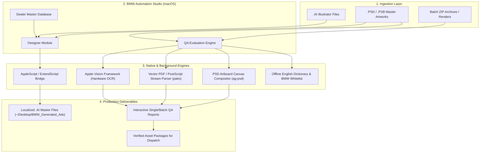

# BMW Automation Studio — Operational & Technical Handbook
### Strategic Business Specifications & Standard Operating Procedures (SOP) for OMC, Designers, and QA Teams

---

## Document Overview & Control

| Attribute | Details |
| :--- | :--- |
| **Document Title** | BMW Automation Studio — Operations & User Handbook |
| **Version** | 1.0 (Production Release) |
| **Target Audience** | OMC Leadership, Account Directors, Creative Directors, Production Operations Managers, Art Directors, Production Designers, QA Engineers & Proofreaders |
| **Applicable Platforms** | macOS 12.0+ (Apple Silicon & Intel) |
| **Core Ecosystem** | Adobe Illustrator, Adobe Photoshop, Apple Vision Framework, Electron, React |
| **Confidentiality** | Proprietary & Confidential — Interpublic Group (IPG) / Craft Worldwide & BMW Group |

---

## Table of Contents

- [1. Executive Summary & OMC Business Context](#1-executive-summary--omc-business-context)
  - [1.1 The Role of the OMC in Campaign Rollouts](#11-the-role-of-the-omc-in-campaign-rollouts)
  - [1.2 The Production Paradox: The Manual Adaptation Bottleneck](#12-the-production-paradox-the-manual-adaptation-bottleneck)
  - [1.3 Strategic Solution: End-to-End Automation](#13-strategic-solution-end-to-end-automation)
- [2. OMC Value Proposition & Operational Impact](#2-omc-value-proposition--operational-impact)
  - [2.1 Quantitative KPI Impact Matrix](#21-quantitative-kpi-impact-matrix)
  - [2.2 Core Operational Benefits for OMC](#22-core-operational-benefits-for-omc)
- [3. System Architecture & Capabilities Overview](#3-system-architecture--capabilities-overview)
  - [3.1 High-Level Operational Architecture](#31-high-level-operational-architecture)
  - [3.2 The Three Operational Pillars](#32-the-three-operational-pillars)
- [4. Designer's Operational Guide & Technical SOP](#4-designers-operational-guide--technical-sop)
  - [4.1 Workstation Setup & Prerequisites](#41-workstation-setup--prerequisites)
  - [4.2 Master Artwork Preparation Standards](#42-master-artwork-preparation-standards)
  - [4.3 Step-by-Step Workflow: Automated Dealer Adaptations](#43-step-by-step-workflow-automated-dealer-adaptations)
  - [4.4 Best Practices & Common Pitfalls for Designers](#44-best-practices--common-pitfalls-for-designers)
- [5. QA Engineer & Proofreader's Operational Guide & Technical SOP](#5-qa-engineer--proofreaders-operational-guide--technical-sop)
  - [5.1 The QA Philosophy: Hybrid Deterministic & Computer Vision QC](#51-the-qa-philosophy-hybrid-deterministic--computer-vision-qc)
  - [5.2 Asset Ingestion Standards (Single, Multi-Artboard PSD, ZIP)](#52-asset-ingestion-standards-single-multi-artboard-psd-zip)
  - [5.3 Step-by-Step Workflow: Ingestion, Analysis & Evaluation](#53-step-by-step-workflow-ingestion-analysis--evaluation)
  - [5.4 Interpreting the QC Report](#54-interpreting-the-qc-report)
  - [5.5 Defect Classification & Decision Matrix](#55-defect-classification--decision-matrix)
- [6. Technical Maintenance & Customization](#6-technical-maintenance--customization)
  - [6.1 Updating Dealership Master Records](#61-updating-dealership-master-records)
  - [6.2 Maintaining the BMW Brand Whitelist & Dictionary](#62-maintaining-the-bmw-brand-whitelist--dictionary)
  - [6.3 Recompiling the Native OCR Engine](#63-recompiling-the-native-ocr-engine)
- [7. Operational Troubleshooting & FAQs](#7-operational-troubleshooting--faqs)

---

## 1. Executive Summary & OMC Business Context

### 1.1 The Role of the OMC in Campaign Rollouts
The **Omnichannel Marketing Center (OMC)** serves as the operational engine for BMW marketing. Operating within creative production agency frameworks (such as Craft Worldwide / IPG), the OMC is tasked with:
- **Centralizing Marketing Production**: Taking central master creative concepts from global and national creative agencies and localizing them across regional hubs.
- **Managing Multi-Channel Distribution**: Generating high-fidelity visual assets across Print (magazines, newspapers), Out-of-Home (OOH hoardings, transit shelters, airport billboards), Digital Display (standard IAB banners, rich media), Social Media (1:1 feed carousels, 9:16 vertical stories), and CRM/Direct Marketing (responsive HTML emails).
- **Managing Dealer Syndication**: Ensuring that localized regional dealer networks (e.g., Infinity Cars, Navnit Motors, KUN Exclusive, Deutsche Motoren) receive compliant, tailored marketing collateral featuring exact legal trade names, addresses, phone numbers, and digital properties.

### 1.2 The Production Paradox: The Manual Adaptation Bottleneck
Modern automotive marketing demands personalized, localized messaging at high scale. However, traditional creative adaptation workflows rely on manual, repetitive human labor:
1. **The Copy-Paste Trap**: A designer opens a master `.ai` or `.psd` file, manually copies address and phone details from an Excel spreadsheet, pastes them into the artwork, adjusts text box frames, re-exports, renames the file according to naming conventions, and saves it. For 5 sizes across 12 dealers, this represents **60 individual manual file edits**.
2. **Human Fatigue & Transcription Errors**: After hours of repetitive manual edits, typos inevitably creep into critical fields: a transposed digit in a customer care phone number, a misspelled URL, or an omitted regulatory interest rate disclaimer.
3. **The Proofreading Bottleneck**: The Quality Assurance (QA) team or copy-proofreaders must open each exported image or PDF one-by-one, manually reading microscopic 6pt disclaimers and cross-referencing contact sheets.
4. **Catastrophic Failure Costs**: A single printing error on a nationwide newspaper insert or roadside billboard can result in hundreds of thousands of dollars in reprint costs, regulatory investigations, or brand embarrassment.

### 1.3 Strategic Solution: End-to-End Automation
**BMW Automation Studio** bridges desktop creative software with native system intelligence. By unifying Adobe Illustrator scripting, Photoshop artboard parsing, Apple Vision neural OCR, and automated dictionary checking in a single native macOS application, the studio creates a closed-loop production environment:

```
[ Master Creative File (.ai / .psd) ]
                 │
                 ▼
     [ BMW Automation Studio ]
    ┌────────────┴────────────┐
    │                         │
    ▼                         ▼
[ Designer Tools ]     [ QA Evaluation Engine ]
• Native Illustrator   • Hardware Vision OCR
  DOM Automation       • Vector PDF/PSD Stream
• 1-Click Dealer         Extraction
  Syndication          • BMW Brand Whitelist
• Sub-second Export    • Automated Dimension
                         & Typo Detection
    │                         │
    └────────────┬────────────┘
                 │
                 ▼
[ Zero-Defect Campaign Release ]
```

---

## 2. OMC Value Proposition & Operational Impact

### 2.1 Quantitative KPI Impact Matrix

| Operational Metric | Traditional Manual Workflow | With BMW Automation Studio | Variance / Benefit |
| :--- | :--- | :--- | :--- |
| **Adaptation Speed per Dealer** | 10 to 15 minutes | **< 3 seconds** | **99% reduction** |
| **Turnaround Time (5 sizes x 10 dealers)** | 8.5 to 12.5 production hours | **< 15 minutes (setup + export)** | **~97% reduction** |
| **Quality Control Inspection Time** | 3 to 5 minutes per asset | **Instantaneous batch scan** | **95% reduction** |
| **Batch Archive QA (100 Assets in ZIP)** | 5 to 6 hours of manual review | **< 60 seconds automated scan** | **98% time saved** |
| **Transcription Error Escape Rate** | 3.5% to 5.0% | **0.0% (automated binding)** | **Total elimination** |
| **Campaign Go-Live SLA** | 3 to 5 business days | **Same-day delivery (< 4 hours)** | **70–80% SLA compression** |
| **Production Overtime & Remake Cost** | High (frequent sprint overruns) | **Near zero** | **Direct margin expansion** |

### 2.2 Core Operational Benefits for OMC

#### 1. Throughput & Scalability Without Linear Headcount
Traditionally, handling a 40% increase in campaign volume required hiring additional production artists or contracting expensive freelance support. With automated batch variation generation, existing studio staff can generate and inspect hundreds of assets in minutes, enabling the OMC to absorb massive campaign surges effortlessly.

#### 2. SLA Compression & Market Responsiveness
Automotive marketing is highly time-sensitive—seasonal campaigns, weekend test-drive events, and competitive interest rate adjustments demand rapid turnaround. By compressing the turnaround cycle from days to hours, the OMC delivers unprecedented agility to regional marketing directors.

#### 3. Zero-Defect Brand Integrity & Legal Governance
BMW enforces strict Corporate Identity (CI) guidelines:
- Typography must utilize official **BMW Type Next** fonts.
- Models and proprietary innovations must maintain exact trademark capitalization (`xDrive`, `sDrive`, `TwinPower Turbo`, `Steptronic`, `i4`, `i7`, `M Performance`).
- Financial disclaimers (MSRP, APR, EMI, WLTP range) must be present and legible.
Automated validation checks every character against the official brand whitelist, ensuring non-compliant assets never reach media publications or print houses.

#### 4. Relieving Creative Burnout & Raising Studio Morale
Manual copy-pasting and visual proofreading of disclaimer copy is soul-crushing work that leads to designer fatigue and attrition. Automating these mechanical tasks elevates designers to focus on high-value creative adaptation, key visual ideation, and layout polish.

---

## 3. System Architecture & Capabilities Overview

### 3.1 High-Level Operational Architecture



### 3.2 The Three Operational Pillars

```
┌─────────────────────────────────────────────────────────────────────────┐
│                        BMW AUTOMATION STUDIO                            │
├───────────────────┬─────────────────────────┬───────────────────────────┤
│  DESIGNER TOOLS   │     DEVELOPER TOOLS     │       QA EVALUATION       │
├───────────────────┼─────────────────────────┼───────────────────────────┤
│ • Master Ingestion│ • BMW EDM Scaffolding   │ • Universal Multi-Format  │
│ • Live AI Sync    │ • Email HTML Compliance │ • Apple Vision OCR        │
│ • SVG Overlay Map │ • Responsive Templates  │ • Deep Artboard Inspection│
│ • Batch Variations│ • Brand Layout Guards   │ • BMW Whitelist Check     │
└───────────────────┴─────────────────────────┴───────────────────────────┘
```

1. **Designer Tools**: Focuses on upstream production—extracting visual layers from Adobe Illustrator, binding target dealer text frames, and batch-exporting print/digital artwork without human transcription.
2. **Developer Tools**: Standardizes Email Direct Marketing (EDM) generation, enforcing BMW digital standards across HTML email layouts.
3. **QA Evaluation**: Focuses on downstream verification—scanning final visual assets (whether exported by the tool or submitted by external agency partners) for dimensions, aspect ratios, file specifications, text accuracy, and brand nomenclature.

---

## 4. Designer's Operational Guide & Technical SOP

### 4.1 Workstation Setup & Prerequisites

Before running the Designer Tools module, ensure your macOS workstation meets the following operational criteria:

1. **Installing the Desktop App (`.dmg`)**:
   - Download the official release package (`BMW Auto-0.0.0-arm64.dmg`) from your studio's shared drive or release portal.
   - Double-click the `.dmg` file and drag **BMW Auto** into your **Applications** folder.
   - *First-time launch note*: If prompted by macOS Gatekeeper, Right-click `BMW Auto.app` > **Open** > **Open**, or visit `System Settings > Privacy & Security` and click **Open Anyway**.
2. **Operating System**: macOS Monterey (12.0) or higher (macOS Sonoma or Sequoia recommended).
3. **Adobe Illustrator**: Installed and licensed via Adobe Creative Cloud.
4. **macOS Automation Permissions**:
   - The first time BMW Automation Studio communicates with Adobe Illustrator, macOS displays a security prompt:
     > *"BMW Auto wants access to control Adobe Illustrator"*
   - Click **OK / Allow**.
   - If you accidentally clicked "Don't Allow", enable it manually:
     `System Settings > Privacy & Security > Automation > BMW Auto > Enable Adobe Illustrator`.
5. **BMW Corporate Fonts**:
   - Ensure `BMWTypeNext-Light.otf` and `BMWTypeNext-Bold.otf` are installed in your macOS Font Book (`/Library/Fonts` or `~/Library/Fonts`).

---

### 4.2 Master Artwork Preparation Standards

To ensure 100% automated synchronization between Adobe Illustrator and BMW Automation Studio, designers must follow these standard master setup rules:

```
┌────────────────────────────────────────────────────────┐
│ MASTER ARTWORK PREPARATION RULES                       │
├────────────────────────────────────────────────────────┤
│ 1. Text Layer Isolation                                │
│    Keep the dealer address, phone number, and URL in   │
│    a dedicated, un-grouped text frame.                 │
│                                                        │
│ 2. Unlocked Status                                     │
│    Ensure the target text frame and its parent layer   │
│    are UNLOCKED and VISIBLE in the Layers panel.       │
│                                                        │
│ 3. Enable PDF Compatibility on Save                    │
│    Always save Illustrator files with:                 │
│    [✓] "Create PDF Compatible File"                    │
│                                                        │
│ 4. Single Master Artboard                              │
│    Ensure the active master layout is on Artboard 1.   │
└────────────────────────────────────────────────────────┘
```

> [!IMPORTANT]
> **Why "Create PDF Compatible File" is Mandatory**:
> When an Illustrator file (`.ai`) is saved with PDF compatibility enabled, Adobe Illustrator embeds a pristine vector PDF stream inside the file container. BMW Automation Studio uses this internal stream to generate crisp, high-DPI in-app canvas previews without launching the Illustrator application. If this option is omitted, the studio will fall back to reading low-resolution XMP thumbnails.

---

### 4.3 Step-by-Step Workflow: Automated Dealer Adaptations

Follow this procedure to generate dealer variations for a campaign:

```
[ Step 1: Launch Illustrator & Open Master ]
                    │
                    ▼
[ Step 2: Open BMW Automation Studio -> Designer Tools ]
                    │
                    ▼
[ Step 3: Select Master File (.ai / .psd) ]
                    │
                    ▼
[ Step 4: Click 'Sync Layers from Illustrator' ]
                    │
                    ▼
[ Step 5: Click Target Dealer Text Block on Canvas ]
                    │
                    ▼
[ Step 6: Select Dealerships from Database ]
                    │
                    ▼
[ Step 7: Click 'Generate AI Variations' ]
                    │
                    ▼
[ Completed: Files Ready on Desktop/BMW_Generated_Ads ]
```

#### Detailed Procedural Steps:

#### Step 1: Open Master in Adobe Illustrator
Launch Adobe Illustrator and open your master campaign artwork (e.g., `BMW_X5_Launch_Print_Master.ai`). Ensure the document remains open in Illustrator.

#### Step 2: Select Designer Tools in BMW Automation Studio
Launch **BMW Auto** from your Applications folder. In the left navigation sidebar, select **Designer Tools**.

#### Step 3: Ingest the Master Design File
Under **Process Master File**, click **Select File** and pick the `.ai` or `.psd` master file.
- The system will analyze the master file and display a high-resolution preview along with metadata (dimensions, file size, format).

#### Step 4: Sync Layers from Adobe Illustrator
Click the button:
```
[ Sync Layers from Illustrator ]
```
- The application executes an AppleScript bridge query to the live Illustrator document.
- It calculates artboard boundaries and reads all visible `textFrames`.
- It overlays transparent interactive blue bounding boxes across all text elements in the studio preview window.

#### Step 5: Bind the Target Dealer Layer
In the studio preview window, move your mouse over the text boxes.
- Hovering over a text block will illuminate it.
- **Click directly on the dealer address block**.
- The highlight will turn **Bright Green**, and the status will update to:
  > `✓ Target text block selected`

#### Step 6: Select Dealerships from Database
In the **BMW Dealers Database** panel on the right sidebar, check the boxes for all dealerships required for this adaptation sprint (e.g., *BMW Infinity Cars Worli*, *BMW Navnit Motors Andheri*).
- You can select individual dealers or multiple locations.

#### Step 7: Execute Batch Generation
Click the primary action button:
```
[ Generate AI Variations ]
```
- The status will transition to `Processing...`.
- Behind the scenes, the automation engine:
  1. Communicates directly with the active Illustrator session.
  2. Preserves the original text block state.
  3. Iterates through each selected dealer record.
  4. Injects the formatted dealer details (Name, Tel, Location, URL).
  5. Executes `doc.saveAs` with full PDF compatibility to:
     `~/Desktop/BMW_Generated_Ads/<dealer_name>.ai`.
  6. Reverts the master document back to its pristine original state upon completion.

#### Step 8: Verification Alert
Once complete, an alert appears:
> `Successfully generated X variations! Saved to: Desktop/BMW_Generated_Ads/`
Click OK. Open your desktop folder to inspect the generated production-ready assets.

---

### 4.4 Best Practices & Common Pitfalls for Designers

| Scenario | Problem | Corrective Action |
| :--- | :--- | :--- |
| **"No documents open in Illustrator"** | The master file was closed in Illustrator. | Re-open the master file in Illustrator before clicking "Sync Layers". |
| **"Could not find target layer"** | Target layer was locked or deleted in Illustrator after syncing. | Unlock the layer in Illustrator's Layers panel and click "Sync Layers" again. |
| **Preview looks blurry / pixelated** | Illustrator file was saved without PDF compatibility. | In Illustrator, choose `File > Save As`, ensure `[✓] Create PDF Compatible File` is checked, and re-select the file in the studio. |
| **Text frame overflows in output** | Replacement dealer address has longer line lengths than the master text box. | In master artwork, ensure the text frame is set to **Area Type** with sufficient vertical breathing room rather than fixed Point Type. |

---

## 5. QA Engineer & Proofreader's Operational Guide & Technical SOP

### 5.1 The QA Philosophy: Hybrid Deterministic & Computer Vision QC

Traditional OCR tools fail in automotive advertising proofreading for two reasons:
1. **Auto-Correction Masks Errors**: Standard OCR engines employ dictionary language models that automatically "fix" typos (e.g., transcribing *"posible"* as *"possible"*), completely blinding the QA team to real errors.
2. **Rasterization Noise**: Standard web OCR struggles with high-resolution 300 DPI print files or micro-legal disclaimers placed on photographic backgrounds with gradients.

#### The BMW Automation Studio Hybrid Engine Solution:
```
                              [ Input Asset ]
                                     │
                 ┌───────────────────┴───────────────────┐
                 │                                       │
           [ Layered PSD ]                         [ Flattened Image ]
                 │                                 (JPG, PNG, TIFF, WebP)
                 ▼                                       │
     [ Vector / Text Decoder ]                           ▼
   • Direct native text layers               [ Apple Vision OCR Engine ]
   • Embedded Smart Objects (AI/PDF)         • Hardware-accelerated Neural Engine
     decompressed via pako                   • Language Correction DISABLED
   • 100% Vector Transcription Accuracy        (Preserves authentic typos)
                 │                           • Minimum Text Height = 0.0
                 │                             (Catches 4pt micro-legal disclaimers)
                 │                           • Dynamic Resolution Upscaler
                 │                                       │
                 └───────────────────┬───────────────────┘
                                     │
                                     ▼
                      [ Offline Lexical Analyzer ]
                      • 2.49 MB English Dictionary
                      • BMW Proprietary Whitelist (Models, Tech, WLTP)
                      • 40+ Morphological Suffix Stemmers
                                     │
                                     ▼
                      [ Itemized Defect Report ]
```

---

### 5.2 Asset Ingestion Standards (Single, Multi-Artboard PSD, ZIP)

The QA Evaluation module supports three distinct operational ingestion modes:

1. **Single Asset Mode**:
   - Drag and drop any individual graphic file: `.jpg`, `.jpeg`, `.png`, `.webp`, `.bmp`, `.tiff`.
   - Used for quick ad-hoc inspection of a master key visual or social post.
2. **Multi-Artboard Master PSD Mode**:
   - Drag and drop a layered Photoshop document (`.psd` or `.psb`).
   - The engine automatically detects all embedded artboards (`Artboard 1`, `300x250`, `Instagram_Story_9x16`, etc.).
   - Evaluates each artboard as an independent sub-asset with dedicated previews and metadata.
3. **Batch ZIP Archive Mode (Mass Campaign Audit)**:
   - Drag and drop a `.zip` file containing tens or hundreds of exported campaign banners.
   - The engine decompresses the archive in-memory, automatically strips out macOS hidden folders (`__MACOSX`, `.DS_Store`), and evaluates every contained image sequentially.

---

### 5.3 Step-by-Step Workflow: Ingestion, Analysis & Evaluation

```
[ Step 1: Open QA Evaluation Module ]
                 │
                 ▼
[ Step 2: Drag & Drop Asset(s) / ZIP into Dropzone ]
                 │
                 ▼
[ Step 3: Monitor Real-Time Progress Bar ]
                 │
                 ▼
[ Step 4: Review Summary KPI Stats & Badges ]
                 │
                 ▼
[ Step 5: Drill Down into Flagged Assets ]
                 │
                 ▼
[ Step 6: Verify Typos, Disclaimers & Specs ]
```

#### Step 1: Navigate to QA Evaluation
Click on **QA Evaluation** in the left sidebar. You will see the file dropzone.

#### Step 2: Ingest Assets
Drag and drop your asset file (e.g., `BMW_Summer_Campaign_Assets.zip` or individual `.png`/`.psd` files) directly onto the dotted dropzone area, or click the box to browse via Finder.

#### Step 3: Ingestion & Analysis Progress
The view transitions to **Analyzing Assets**:
- A real-time progress bar displays current status:
  - *Reading PSD file buffer...*
  - *Parsing PSD layers & artboards...*
  - *Decompressing embedded smart objects...*
  - *Running OCR analysis (Asset X of Y)...*
  - *Checking spelling against BMW whitelist...*

#### Step 4: Access the QC Report View
Once analysis reaches 100%, the studio immediately presents the **QC Report**.

---

### 5.4 Interpreting the QC Report

The report dynamically switches between **Single Image Mode** and **Batch Report Mode**.

#### Single Image Report Elements:
```
┌───────────────────────────────────────┬──────────────────────────────────────────┐
│             IMAGE PREVIEW             │        DIMENSIONS & SPECIFICATIONS       │
│                                       ├──────────────────────────────────────────┤
│                                       │ Width: 1920px        Height: 1080px      │
│                                       │ Aspect Ratio: 16:9   Color: 24-bit (RGB) │
│                                       ├──────────────────────────────────────────┤
│                                       │            FILE INFORMATION              │
│                                       │ Format: JPEG         Size: 1.42 MB       │
│                                       ├──────────────────────────────────────────┤
│                                       │       CONTENT & SPELLING ANALYSIS        │
│                                       │ Status: 🚩 2 Issues                      │
│                                       │ OCR Confidence: [████████████░░] 88%     │
│                                       │                                          │
│                                       │ Extracted Text:                          │
│                                       │ "The all-new BMW i7 with xDrive...       │
│                                       │  Contact us for special financng terms"  │
│                                       │                                          │
│                                       │ Flagged Spelling Issues:                 │
│                                       │ 🚩 financng                              │
│                                       │    "...special financng terms..."        │
└───────────────────────────────────────┴──────────────────────────────────────────┘
```

1. **Dimensions & Specs Card**: Confirms canvas pixel width, height, aspect ratio (e.g., `16:9`, `1:1`, `~9:16`), and color depth.
2. **File Information Card**: Displays format, formatted file size (in KB or MB), and last modified timestamp.
3. **Content & Spelling Card**:
   - **Confidence Meter**: Percentage score representing OCR recognition accuracy. For native PSD text, this is 100%.
   - **Extracted Text Box**: Complete verbatim text extracted from the asset.
   - **Spelling Issues List**: Every flagged word is displayed in red with surrounding context to enable instantaneous diagnosis.

#### Batch Report Mode Elements:
When analyzing multiple files or a ZIP archive, the top of the report displays high-level KPIs:
- **Total Images**: Total count of assets processed.
- **Total Size**: Aggregate byte size of the campaign batch.
- **Passed**: Count of assets that contain no spelling defects.
- **Flagged**: Count of assets that contain one or more suspicious spellings.

Beneath the KPI cards is the interactive **Asset Table**:
- Columns: Thumbnail, File Name, Dimensions, Format & Size, Status.
- Clicking any row smoothly expands the full inspection drawer for that specific image without leaving the batch report view.

---

### 5.5 Defect Classification & Decision Matrix

When reviewing flagged items, QA engineers must classify findings according to this standard operating matrix:

| Status Badge | Trigger Condition | Severity | Required QA Action |
| :--- | :--- | :--- | :--- |
| **🚩 Flagged (Red)** | Word detected that is neither in the English dictionary nor the BMW Whitelist (e.g., *"financng"*, *"exclusiv"*). | **High (Defect)** | **Reject Asset.** Log the exact typo and notify the production artist for immediate correction. |
| **✅ Pass (Green)** | Text extracted cleanly; all words match standard dictionary or verified BMW nomenclature. | **None (Approved)** | **Approve Asset.** File passes content quality control. |
| **— No Text (Gray)** | No text glyphs detected (e.g., pure photographic backgrounds, textures, or image-only crops). | **Informational** | **Verify Intent.** If the asset was intended to have disclaimers, flag as missing copy. If purely background art, approve. |
| **False Positive** | Valid local proper noun, new dealership name, or regional city not yet in whitelist (e.g., new dealer *"Bavaria Motors"*). | **Low** | **Verify & Log.** Verify correctness manually. If confirmed accurate, request the Tech Lead add the word to the BMW Whitelist. |

---

## 6. Technical Maintenance & Customization

### 6.1 Updating Dealership Master Records
The dealership directory is maintained in [`src/components/DealersDatabase.tsx`](file:///Users/mehul.rana/Library/CloudStorage/OneDrive-Interpublic/Projects-2026/BMW-automation/bmw-app/bmw-macOs-app/src/components/DealersDatabase.tsx).

To add, update, or modify dealership contact details:
1. Open [`src/components/DealersDatabase.tsx`](file:///Users/mehul.rana/Library/CloudStorage/OneDrive-Interpublic/Projects-2026/BMW-automation/bmw-app/bmw-macOs-app/src/components/DealersDatabase.tsx).
2. Locate the `MOCK_DEALERS` array:
   ```typescript
   export const MOCK_DEALERS = [
     { id: '1', name: 'BMW Infinity Cars', location: 'Worli', tel: '+91 22 67145100', url: 'www.bmw-infinitycars.in' },
     { id: '2', name: 'BMW Navnit Motors', location: 'Andheri', tel: '+91 22 66777777', url: 'www.bmw-navnitmotors-mumbai.in' },
     // Add new dealership entries here:
     { id: '6', name: 'BMW Deutsche Motoren', location: 'Delhi NCR', tel: '+91 11 41000000', url: 'www.bmw-deutschemotoren.in' },
   ];
   ```
3. Save the file. If running in dev mode, Vite will hot-reload immediately.

---

### 6.2 Maintaining the BMW Brand Whitelist & Dictionary
The BMW-specific terminology whitelist resides in [`src/components/qaUtils.ts`](file:///Users/mehul.rana/Library/CloudStorage/OneDrive-Interpublic/Projects-2026/BMW-automation/bmw-app/bmw-macOs-app/src/components/qaUtils.ts) under `BMW_WHITELIST`.

To add new vehicle models, proprietary technologies, or brand partners:
1. Open [`src/components/qaUtils.ts`](file:///Users/mehul.rana/Library/CloudStorage/OneDrive-Interpublic/Projects-2026/BMW-automation/bmw-app/bmw-macOs-app/src/components/qaUtils.ts).
2. Add lowercase strings to the `BMW_WHITELIST` `Set`:
   ```typescript
   const BMW_WHITELIST = new Set([
     // New 2026 Models
     'neue', 'klasse', 'ix7', 'm3cs',
     
     // New Technologies
     'panoramic', 'vision', 'bidirectional',
     
     // Regional / Market specifics
     'delhi', 'bengaluru', 'mumbai', 'pune',
   ]);
   ```
3. Save the file. The QA spell checker will immediately recognize these additions without flagging them as misspellings.

---

### 6.3 Recompiling the Native OCR Engine
The native OCR engine is written in Swift (`electron/ocr-vision.swift`) and compiled into a standalone Darwin Mach-O binary (`electron/ocr-vision`).

If you modify the Swift source code (for example, adjusting the recognition level or text detection heuristics):
```bash
# Navigate to the workspace root
cd /Users/mehul.rana/Library/CloudStorage/OneDrive-Interpublic/Projects-2026/BMW-automation/bmw-app/bmw-macOs-app

# Compile for Apple Silicon (M1/M2/M3/M4):
swiftc -O -target arm64-apple-macos12.0 electron/ocr-vision.swift -o electron/ocr-vision

# Ensure binary execution permissions:
chmod +x electron/ocr-vision
```

---

## 7. Operational Troubleshooting & FAQs

#### Q1: When clicking "Sync Layers", the app hangs or alerts "AppleScript Error".
- **Root Cause**: Adobe Illustrator is either unresponsive, showing an open dialog box (e.g., Missing Font, Color Profile Mismatch, or Update Links dialog), or macOS blocked automation.
- **Resolution**:
  1. Switch to Adobe Illustrator and dismiss any modal pop-up dialogs.
  2. Verify that **BMW Auto** is permitted to control Illustrator under `System Settings > Privacy & Security > Automation`.

#### Q2: Designer Tools generated variations, but where did the files go?
- **Resolution**: All generated variations are automatically organized into a dedicated folder on the active macOS user's desktop:
  `~/Desktop/BMW_Generated_Ads/<dealer_name>.ai`.

#### Q3: Why does a 300x250 banner ad fail to detect small 5pt disclaimer text?
- **Root Cause**: Low pixel resolution on standard digital display banners (where 5pt text may only be 4–6 pixels high) can fall beneath standard optical OCR thresholds.
- **Resolution**: The engine includes an automatic 4x pre-processing upscaler for images under 1400px. If you still encounter misses on raster assets, ensure the master PSD file is dropped instead—the studio will extract vector text directly from the PSD layer tree with 100% mathematical fidelity.

#### Q4: How do I perform a complete reset/reload of the studio during a session?
- **Resolution**:
  - Click the **Refresh App** button located in the top window bar or bottom of the sidebar.
  - Or press `Cmd + R` inside the window to reload the web view without closing the background Electron process.

---

## Document Sign-Off & Governance

| Role | Name / Title | Department | Signature / Status |
| :--- | :--- | :--- | :--- |
| **Technical Lead** | Mehul Rana | Creative Automation & Technology | Approved |
| **OMC Director** | Operations Leadership | Omnichannel Marketing Center | Active Standard |
| **Brand Governance** | BMW Account Leadership | Craft Worldwide / IPG | Approved CI/CD Standard |
